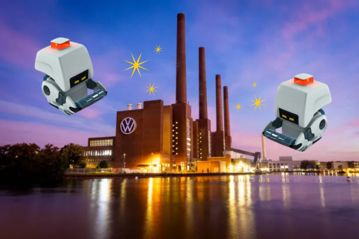

<p align="center">
  
</p>

## M-O: the cleaning robot

_Developed by Celia Pérez Vargas_

You can recognize M-O from the WALL-E film. Now he is part of Volkswagen group, and his software must be re-implemented.

**MoTheRobot** only reacts to an input format such as this:

```
5 5
1 2 N
LMLMLMLMM
3 3 E
MMRMMRMRRM
```
1- First line: the workspace that MO should clean (x and y coordinates).
2- Next lines: the robots, that are pairs of:
- Robot position and orientation (x, y and N,S,W or O)
- Instructions: L (turn 90º left), R (turn 90º right), M (move in the orientation of the robot)

This input returns something like this:

```
1 3 N
5 1 E
```
Which are the positions and orientations of the robot after doing the input instructions.

To test this repo, clone it, open it with your IDE, go to the `Main.kt` file and run the project.

If you want to change the input, just go to the `input.txt` file in the root of the project and modify it, always respecting the sample rules (first the workspace, then the robots, with position + orientation and instructions).

---

## DEVELOPER NOTES

I think that by reading the commits it is quite clear how my development process was, including errors and changing decisions.  
I usually write lots of comments in branches that are not merged into `main`, so I can read and understand the code better (sorry if it seems a bit dirty — since it is only my code, I work this way! But I always clean it before merging into `main`).

### First steps: defining domain.

At first, it was easy, as the challenge description is very clear: a robot has a position and an orientation, and there is a workspace with a max X and a max Y to be cleaned.

Later, I realised that a model for `Instruction` was also needed, but at the beginning I just treated L, R and M as simple `char` values.

After that, I thought about the logic inside the Robot model itself, and I also added a requirement to the Workspace model.

I was using `main` to test the first robot movements.

### Application layer

Thinking in a hexagonal way, there should be a use case that communicates with the domain model and the infrastructure layer. So at first I implemented most of the logic there, knowing that in later steps I would move the parsing logic to the infrastructure layer.

At this point, I got a bit stuck thinking about error handling, as in my current job I usually have to think a lot about errors and edge cases… but that only slowed the process down. So I decided not to implement them until the robot movement and input limitations were clearly defined.

Also, at this point I needed some AI help to find the right algorithm.

### Infrastructure layer

Finally, developing this layer gave me more clarity about what the use case should receive and return. So I created a `RobotProgram` and a `RobotInputCommand` inside the use case. I’m not 100% sure if this is best practice, but it is something I usually do with my team in my current job. This is one of the things I would really like to discuss with you!

I also added a `RobotInputParser` with the parsing logic that was previously inside the use case.

---

### REMAINING FEATURES

I know there are some features that are not implemented. Since I’m currently working on-site (not remote… 😢), this is what I could do with the remaining time and energy. However, I will use a branch called `TEST-BRANCH` to keep adding features and improvements to the repository. Some of them are:

- **Refactors**
    - `RobotInputParser` needs a refactor to split all steps into smaller functions.

- **Requirements**
    - I implemented some validations, but I would like errors to be shown as readable messages in the console instead of making the program crash.
    - Also, the workspace doesn't limit the robot movement yet... but well, they can still use a 'Portal Gun' to return to the other size of the workspace 😄 
  
- **Testing**
    - I’m honestly a bit angry that I didn’t have time to write tests, because it is something I do a lot in my current job. I plan to add unit tests.